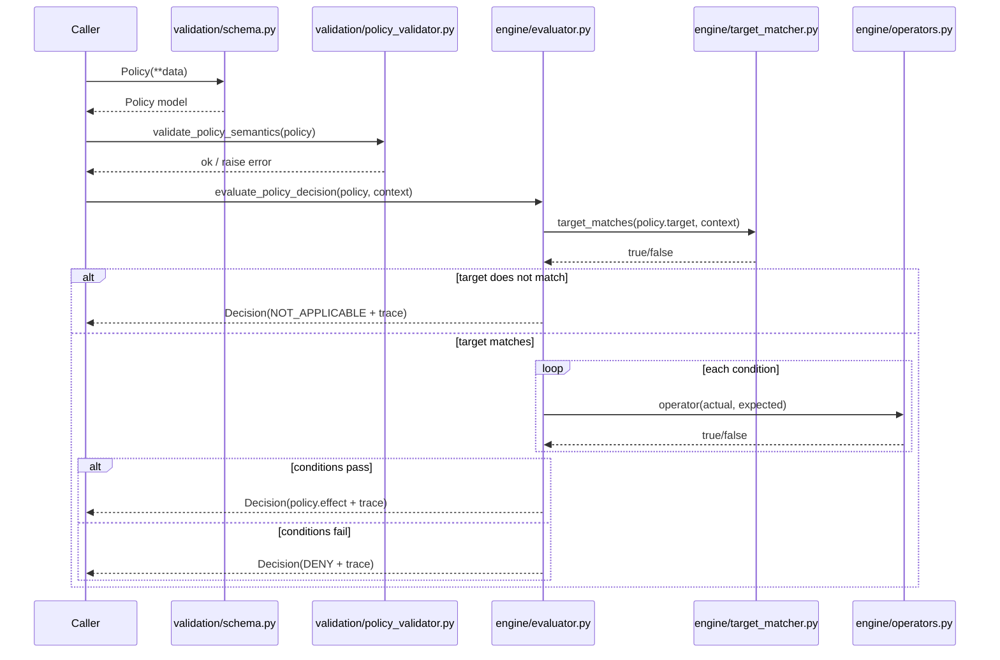

## Decision flow

This document describes how a single policy is evaluated against an incoming request context.

For the contract-level guarantees and terminology, see `docs/policy_contract.md`.

## Inputs

- **Policy**: `validation.schema.Policy`
- **Context**: a dict containing at least:
  - `user`
  - `resource`
  - `environment`

## Outputs

Two common outputs:

- **String decision**: one of `ALLOW`, `DENY`, `NOT_APPLICABLE`
- **Structured decision** (`engine.decision.Decision`): includes `decision`, `policy_id`, `reason`, and a `trace`

## Flowchart (single policy)

```mermaid
flowchart TD
  A[Start] --> B[Parse Policy (schema)]
  B --> C[Validate semantics]
  C --> D{Target matches?}
  D -- no --> NA[Return NOT_APPLICABLE]
  D -- yes --> E{Condition group}
  E -->|ALL| F[Evaluate each condition]
  E -->|ANY| G[Evaluate each condition]
  F --> H{All true?}
  G --> I{Any true?}
  H -- no --> J[Return DENY]
  I -- no --> J
  H -- yes --> K[Return policy.effect]
  I -- yes --> K
```

## Step-by-step

### 1) Structural validation

- The caller constructs a `Policy` model from data.
- Pydantic checks required fields and basic shape.
- The `Conditions` model enforces `all` xor `any`.

### 2) Semantic validation (recommended)

Run `validate_policy_semantics(policy)` to enforce:
- allowed operator names
- safe condition field paths (`user.*`, `resource.*`, `request.*`)
- operator/value compatibility

### 3) Target matching

The evaluator checks whether the policy target applies to the request:
- `target.resource_type` vs `context["resource"]["type"]`
- `target.environment` vs `context["environment"]["env"]`

If it does not match, the decision is `NOT_APPLICABLE`.

### 4) Condition evaluation

For each condition:
- resolve `condition.field` from the context (dotted path)
- apply the operator function to `(actual, condition.value)`

Combination logic:
- `all`: all conditions must be true
- `any`: at least one condition must be true

If the condition group fails, the decision is `DENY`.

### 5) Final decision

If the target matches and the condition group passes, the decision is the policy `effect` (`ALLOW` or `DENY`).

## Sequence diagram (single policy)


