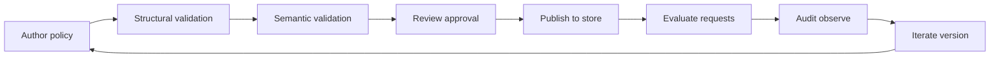

## Policy lifecycle

This document describes a practical lifecycle for policies: how they are authored, validated, reviewed, deployed, and audited.

The design intent is “safe by construction” and “explainable decisions” (see `docs/policy_contract.md`).

## Lifecycle overview

## Authoring

- Policies should be stored as data (YAML/JSON) and treated like code:
  - versioned identifiers (`policy_id` includes a version suffix like `...v1`)
  - small and focused: each policy answers one question
  - descriptive `description` field to capture intent

## Validation gates

### Structural validation (schema)

Use `validation.schema.Policy` to ensure the policy:
- has required fields
- has a valid `Target`
- defines exactly one of `conditions.all` or `conditions.any`
- uses a valid `effect`

### Semantic validation (rules)

Use `validation.policy_validator.validate_policy_semantics(policy)` to ensure:
- operator names are allowed
- field paths are constrained to safe prefixes
- operator/value types make sense

These checks are intended to run:
- locally (pre-commit)
- in CI
- at publish time (policy store ingestion)

## Review / approval

Recommended practice:
- require review for any policy change
- include a short “why” in commit/merge request description
- require unit tests for new operators or new target fields

## Publishing / deployment

Where policies live depends on your system, but common patterns include:
- a Git repo of policy files (reviewed via merge requests)
- a database-backed policy store with an ingestion API

Publishing should be an explicit step with validation enforced.

## Evaluation in production

At runtime:
- fetch the relevant policy (or policy set) for the request
- evaluate deterministically against the request context
- return a decision

This project’s single-policy evaluator can return a structured decision (`engine.decision.Decision`) that includes a trace of target/condition evaluation for auditing.

Invalid request contexts (missing required fields) are rejected by raising `engine.errors.ContextValidationError`.

## Auditing / observability

Capture enough metadata to answer:
- which policy produced a decision
- what inputs were used (or hashes/ids if inputs are sensitive)
- why a decision was made (trace/explanation)

## Versioning and change management

- avoid “breaking edits” to existing policy ids; instead publish a new version:
  - `admin.document.prod.allow.v1` → `admin.document.prod.allow.v2`
- keep old versions for auditability and rollback
